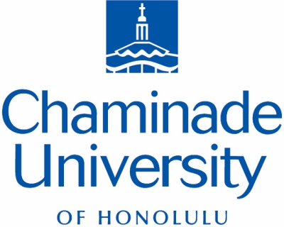

## What is cyberinfrastructure?

Cyberinfrastructure (CI) is a system of people and technologies brought together to perform computational analyses of big data in order to achieve breakthrough science and solve large-scale problems.

In other words, CI involves high-performance computing (HPC), supercomputers, massive data storage and data management systems, specialized applications for modeling, simulation, and analysis, and experts and support staff who help develop and operate these systems.

## Who has access to these resources?

The CI resources discussed in this site are available to U.S. researchers, educators, students, and international collaborators in accordance with NSF policies.

## Who are these resources for?

**If your research or class projects require large amounts of memory storage or computing power - CI is the answer for you!**

## About Chaminade University

Chaminade University of Honolulu is part of the Cyberinfrastructure Pacific Professionals (CIPP) in partnership with University of Hawaii, University of Guam, and Texas Advanced Computing Center. CIPP is a collaborative initiative dedication to strengthening CI capabilities across the Hawaii/Guam and US Affiliated Pacific Islands region.

 
